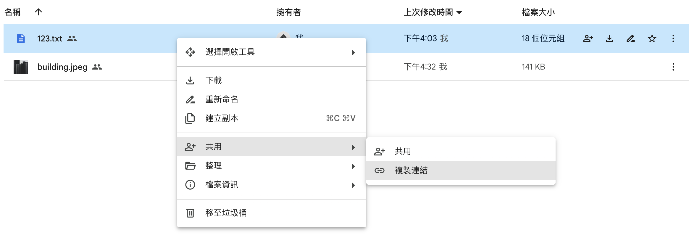
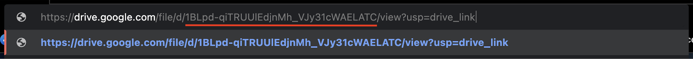

# GoogleAPI_Download_File

You can follow the [Official Instruction](https://developers.google.com/drive/api/quickstart/python?hl=zh-tw) provide by google.

You have to create a [Google Cloud Project](https://developers.google.com/workspace/guides/create-project?hl=zh-tw) first, and activate the [Google Workspace API](https://developers.google.com/workspace/guides/enable-apis?hl=zh-tw). Download the JSON file, then you can continue for the following work.

## Installation

Clone the repo.

```
cd <workspace_folder>
git clone https://github.com/nick8592/GoogleAPI_Download_File.git
```

Create environments

```
conda env create -f environment.yaml
conda activate api
```

## Quickstart

Move `credentials.json` file to `workspace` folder.

```
└── <workspace_folder>
    └──  GoogleAPI_Download_File
        ├── img_source
        ├── README.md
        ├── .gitignore
        ├── environment.yaml
        ├── credentials.json
        └── download_file.py
```

Find your file's `file_id`. Copy shared link.  

Paste shared link on new window, the red line words is your `file_id`.  


Replace `<your_file_id>` with your `file_id` in `download_file.py`.

```
file_id = '<your_file_id>'
```

Run `download_file.py`

```
python download_file.py
```

If download successfully, you can find the file in your `GoogleAPI_Download_File` folder, and the terminal should show

```
>>> File '<your_file_name>' downloaded successfully.
```

## References

[Google Drive API(Python)從 0 開始到從 URL 下載檔案範例](https://medium.com/ai-academy-taiwan/google-drive-api-python-%E5%BE%9E0%E9%96%8B%E5%A7%8B%E5%88%B0%E5%BE%9Eurl%E4%B8%8B%E8%BC%89%E6%AA%94%E6%A1%88%E7%AF%84%E4%BE%8B-a182ce279073)  
[建立 Google Cloud 專案](https://developers.google.com/workspace/guides/create-project?hl=zh-tw)  
[啟用 Google Workspace API](https://developers.google.com/workspace/guides/enable-apis?hl=zh-tw)  
[Python 快速入門導覽課程](https://developers.google.com/drive/api/quickstart/python?hl=zh-tw)  
[下載及匯出檔案](https://developers.google.com/drive/api/guides/manage-downloads?hl=zh-tw#download_a_file_stored_on_google_drive)  
[Set up Application Default Credentials](https://cloud.google.com/docs/authentication/provide-credentials-adc#local-dev)
